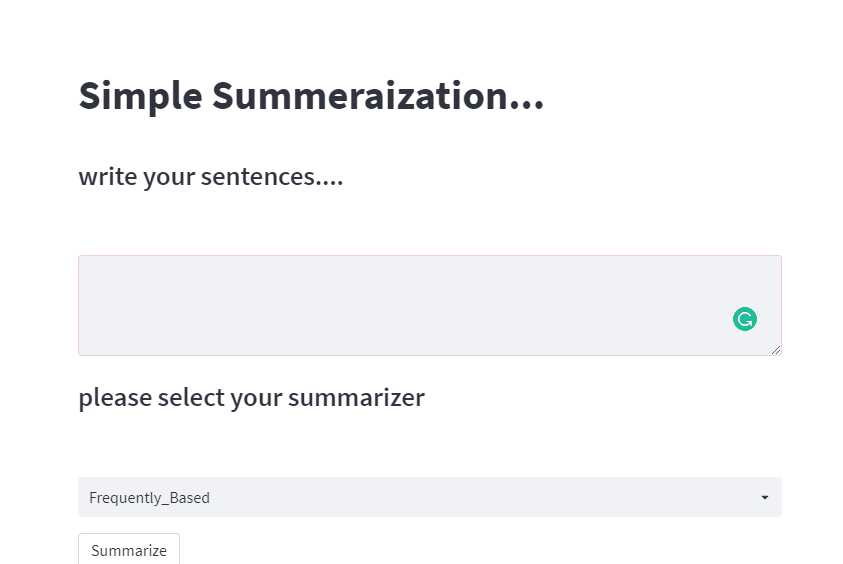

# Text-Summarization
how to run this project:

    git clone https://github.com/mohamadhasan-zeinali/Text-Summarization
    cd Text-Summarization
    pip install -r requirments.txt
    streamlit run summarizer.py
  
    
  
 Enjoy:)

In this project, I illustrate how we can use the Frequently Based algorithm for Text Summarization.

